QGISで地形湿潤指数 (TWI) を計算する方法を紹介します。
TWIは、地形の湿潤度を評価するための指標であり、流域解析や水文学的研究において重要な役割を果たします。
SAGA GISやGRASS GISなどのツールを使用して計算することもできますが、ここではWhiteboxToolsを使用してQGIS内で直接計算する方法を説明します。

## DEMの読み込み

- データソースマネージャを開きます

- 「ラスタ」タブを選択し、DEM (デジタル標高モデル)データを読み込みます。拡張子は`.tif`が一般的です

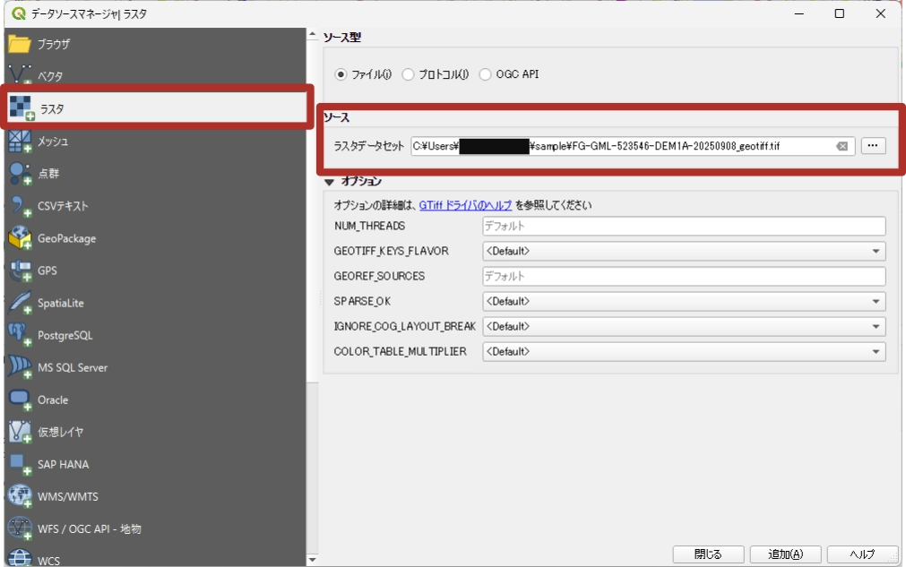

- 読み込んだDEMがQGISのレイヤーパネルに表示されるので確認します

- 必要に応じてレイヤを切り抜きます。「ラスタ」メニューから「抽出」から切り抜くことが可能です

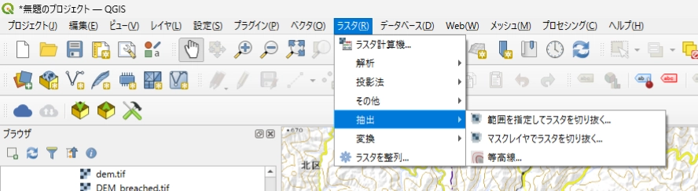

## 座標系の設定

- DEMの座標系を確認します。レイヤを右クリックして「レイヤのCRS」から「レイヤのCRSを設定」を選択します
- **m 単位の投影座標系**を設定します。日本であれば、**JGD2011 平面直角座標系**というものがあります。例えば、京都周辺であればEPSG:6674です。日本における平面直角座標系については、[国土地理院のページ](https://www.gsi.go.jp/LAW/heimencho.html)を参照してください。

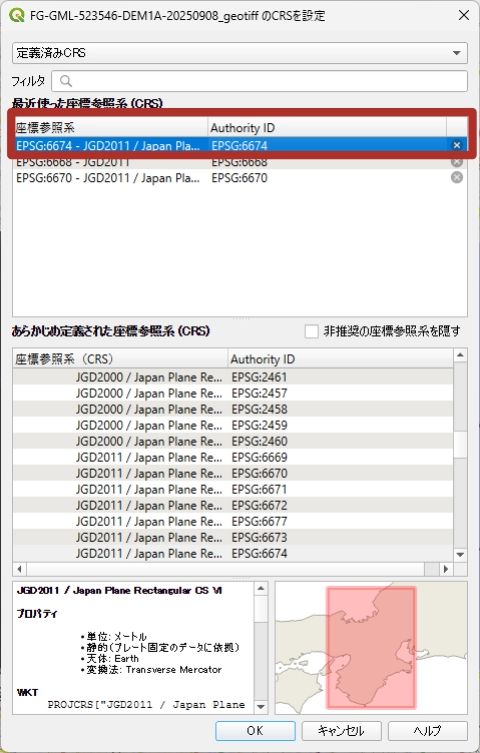

## Breaching Depressions

breaching Depressionsは、DEM内の低地やくぼみを除去する処理です。これにより、流域解析の精度が向上します。
もしこの処理を行わないばあい、小さなくぼみに水が溜まり、流れが途切れたり、方向が不自然になったりすることがあります。

- Whitebox Worlflowsのタブの検索窓に「Breach Depressions」と入力します

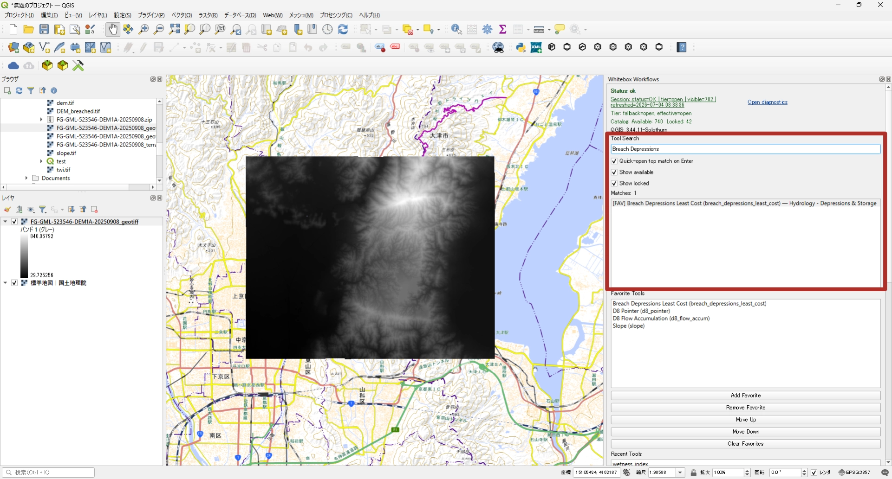

- 表示された「**Breach Depressions Least Cost**」をダブルクリックしてツールウィンドウを開きます
    - **Maximum serch distance in cells**は、くぼみを除去する際の最大探索距離をセル単位で指定します。解像度や目的に応じて適切な値を設定します。今回は1 m解像度でしたので、20セルを指定し、周辺20 mの範囲でくぼみを除去するようにしました。
    - **fill unresolved depression after breaching**は、くぼみを除去した後に残った解決されていないくぼみを埋めるかどうかを指定します。今回はチェックを入れました。
    - 必要に応じて出力ファイルのパスを指定します。今回は指定しませんでした。

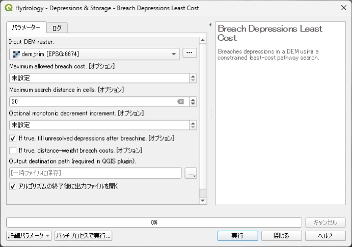

- 結果を確認します。あまり変化はないことが多いかもしれません。「ラスタ計算機」を使用して、元のDEMと比較することもできます。

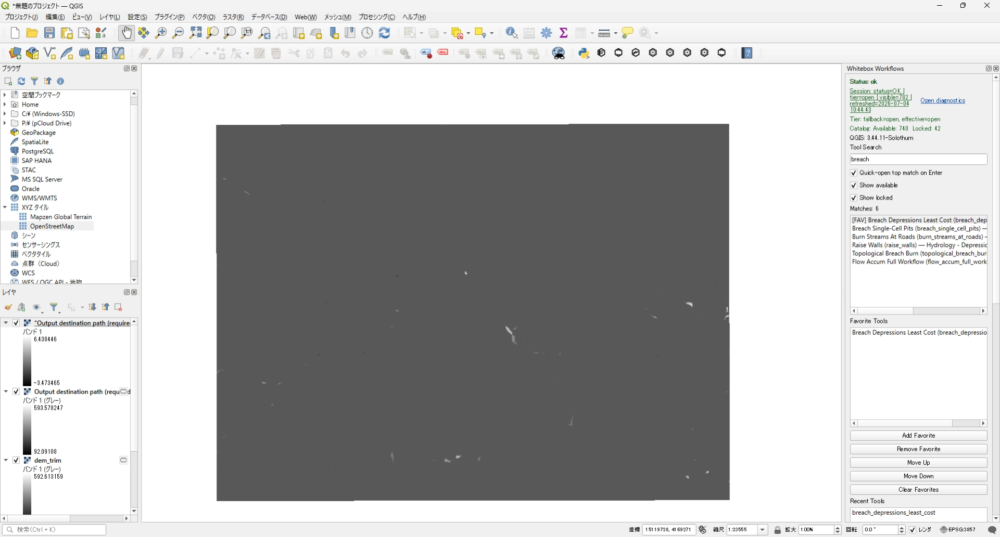

## 流れの方向を計算する

- 検索窓で「D8 Pointer」と検索し、表示された「**D8 Pointer**」をダブルクリックしてツールウィンドウを開きます

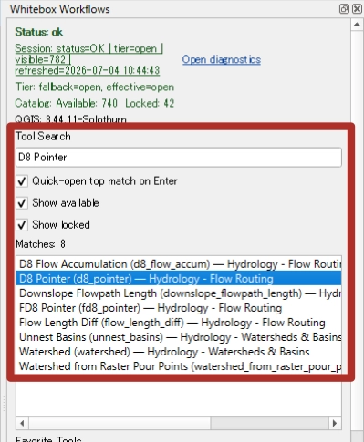

- 基本的にはデフォルトのままで、実行をクリックします。出力ファイルのパスを指定することもできます。

- 結果を確認します。流れの方向が示されたラスタが生成されます。

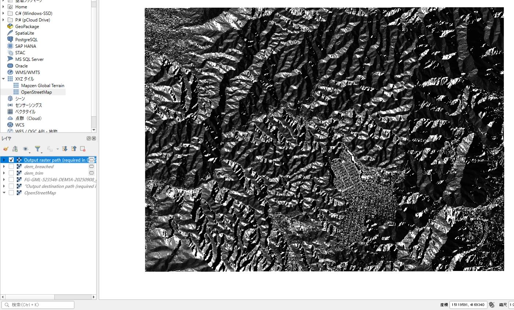

::: {.callout-note}

今回はD8アルゴリズムを使用しましたが、D∞アルゴリズムやFDアルゴリズムなどを使用することもできます。

:::

## 流域蓄積の計算

- 検索窓で「D8 Flow Accumulation」と検索し、表示された「**D8 Flow Accumulation**」をダブルクリックしてツールウィンドウを開きます

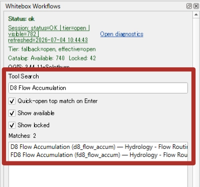

- Input DEMは先ほど出力したD8 Pointerを指定します。
- Output typeはscaを選択します。scaは流域蓄積の値をセル単位で計算する方法です。scaはSpecific Catchment Areaの略で、単位幅あたりの集水面積を表します。
- Treat input as D8 pointer rasterにチェックを入れます。これにより、入力がD8 Pointerラスタであることを指定します。

- 実行し、結果を確認します。

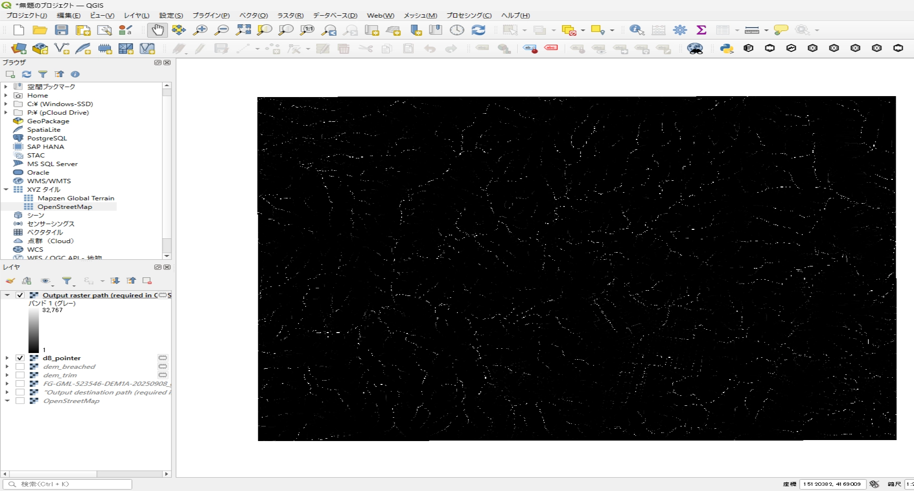

## 傾斜の計算

- 検索窓で「Slope」と検索し、表示された「**Slope**」をダブルクリックしてツールウィンドウを開きます

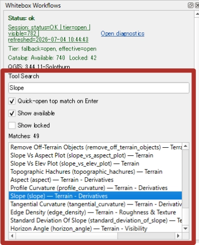

- Input DEMはbreaching depressionを実行したDEMを指定します。
- Output unitはdegreeを選択します。傾斜の単位を度に設定します。
- Z conversion factorは1.0もしくは未設定にします。これはDEMの垂直単位が水平単位と同じである場合に使用します。もしDEMの垂直単位が異なる場合は、適切な変換係数を設定してください。

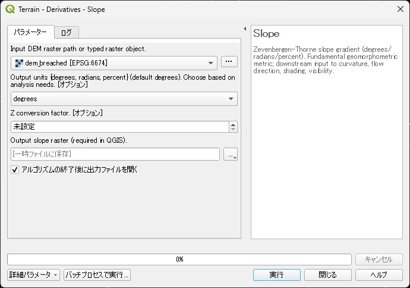

- 実行し、結果を確認します。

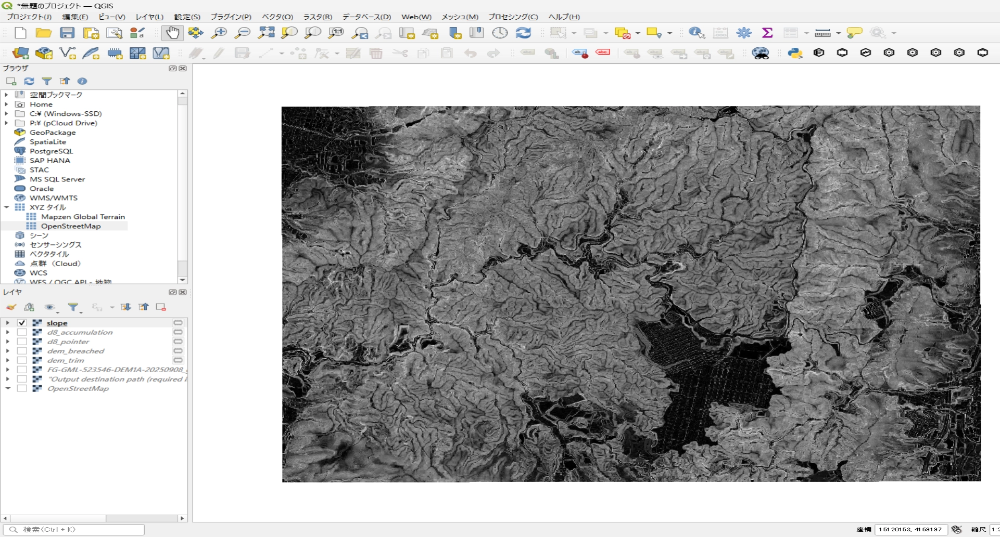

## 地形湿潤指数 (TWI)の計算

- 検索窓で「Wetness Index」と検索し、表示された「**Wetness Index**」をダブルクリックしてツールウィンドウを開きます

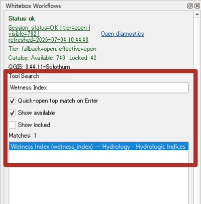

- Specific catchment area rasterは、先ほど計算した流域蓄積のラスタを指定します。
- Slope rasterは、先ほど計算した傾斜のラスタを指定します。

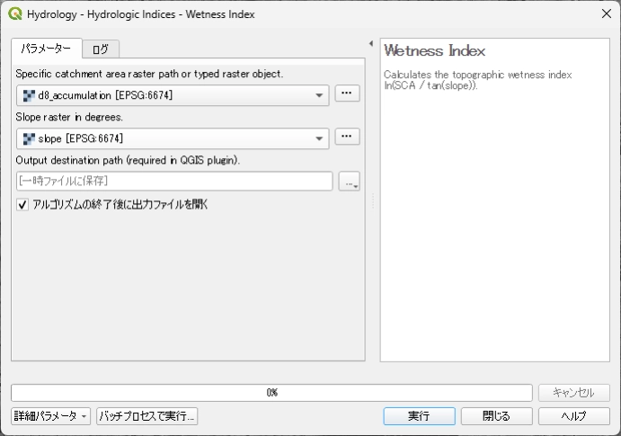

- 実行し、結果を確認します。TWIのラスタが生成されます。

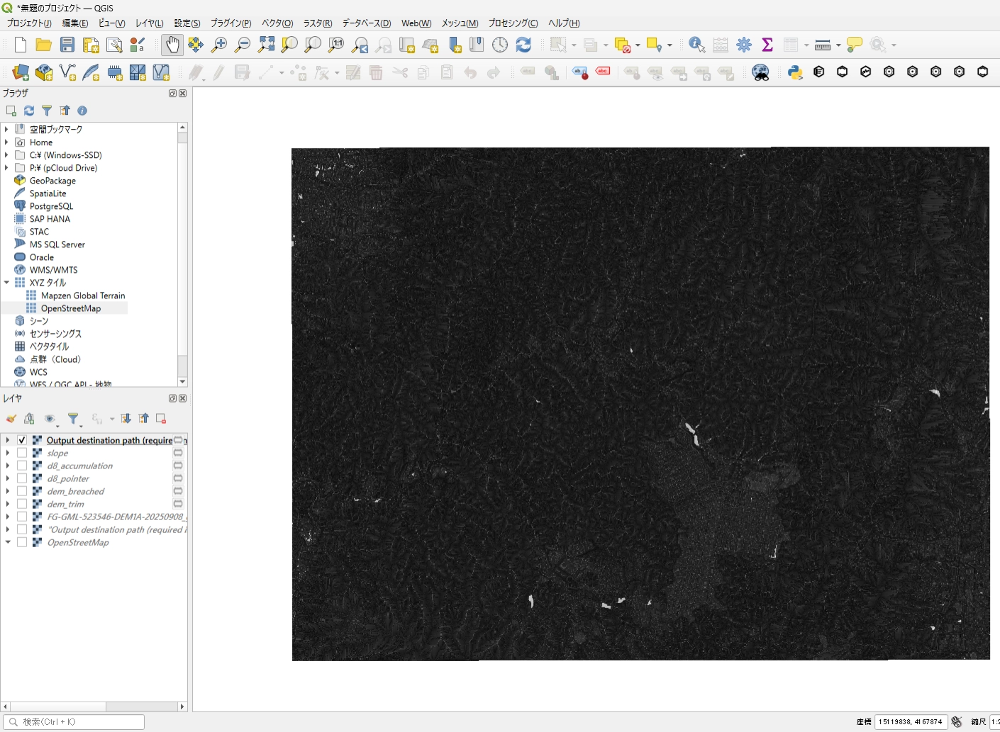

## (任意)結果を見やすくする

デフォルトではカラースケールがグレーで表示されることが多いです。TWIの値を視覚的にわかりやすくするために、カラースケールを変更することができます。

- レイヤを右クリックし、「プロパティ」を選択します
- 「シンポロジ」タブで以下のように設定します
    - レンダリングタイプを：単バンド疑似カラー
    - 補完方法：線形
    - カラーランプ: 任意のカラーランプ。今回はViridisを選択しました

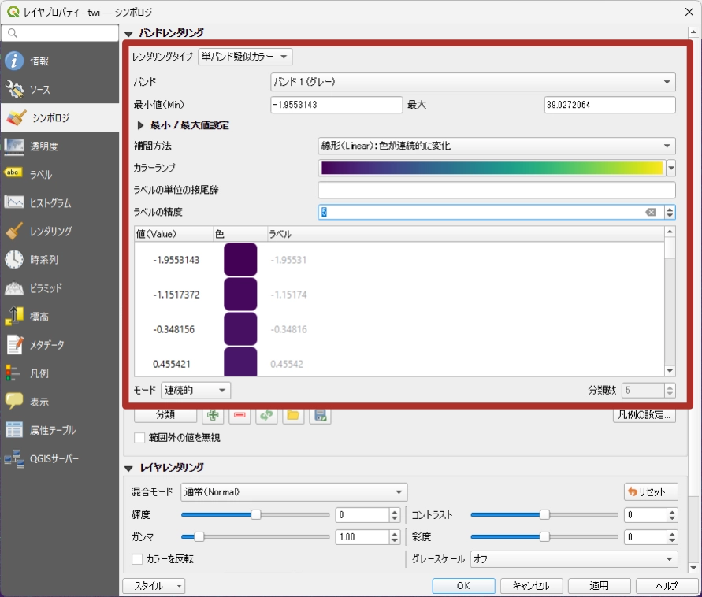

- 適用をクリックすると、TWIの値が色で表現され、視覚的にわかりやすくなります

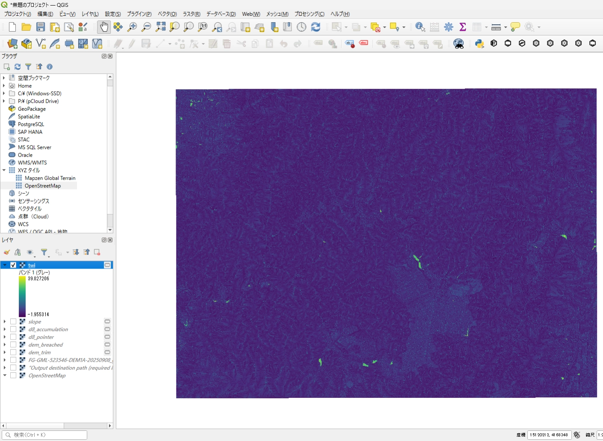

## (おまけ)地形位置指標 (TPI)の計算

地形位置指標は、地形の凸凹や位置を評価するための指標です。TPIは、周囲の標高との差を計算することで、地形の特徴を把握することができます。

- 検索窓で「Difference From Mean Elevation」を検索し、表示された「**Difference From Mean Elevation**」をダブルクリックしてツールウィンドウを開きます

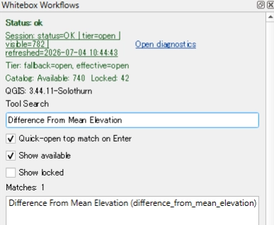

- Input DEMは、元のDEMを指定します。
- Odd filter width in cellsは、横方向のセル数を指定します。今回はデフォルトの11セルを指定しました。DEMの解像度や目的に応じて適切な値を設定する必要があります。
- Odd filter height in cellsも同様に、縦方向のセル数を指定します。今回はデフォルトの11セルを指定しました。基本的には、横方向と縦方向のセル数は同じ値を指定することが多いと思います。

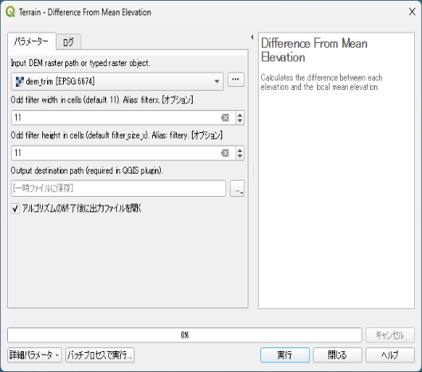

- 実行し、結果を確認します。TPIのラスタが生成されます。

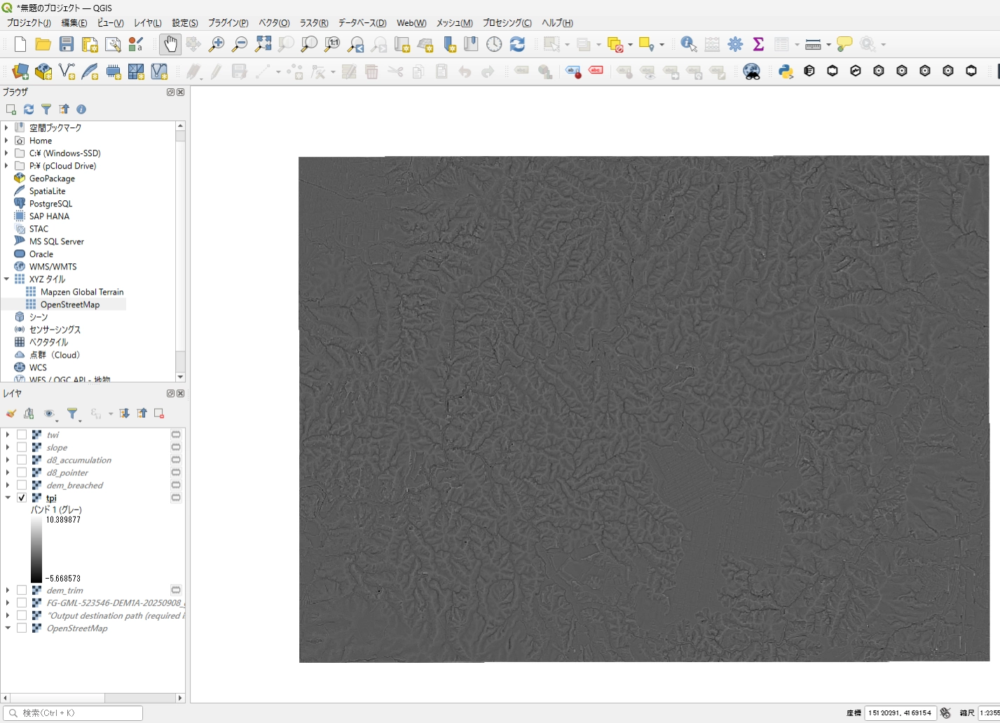
